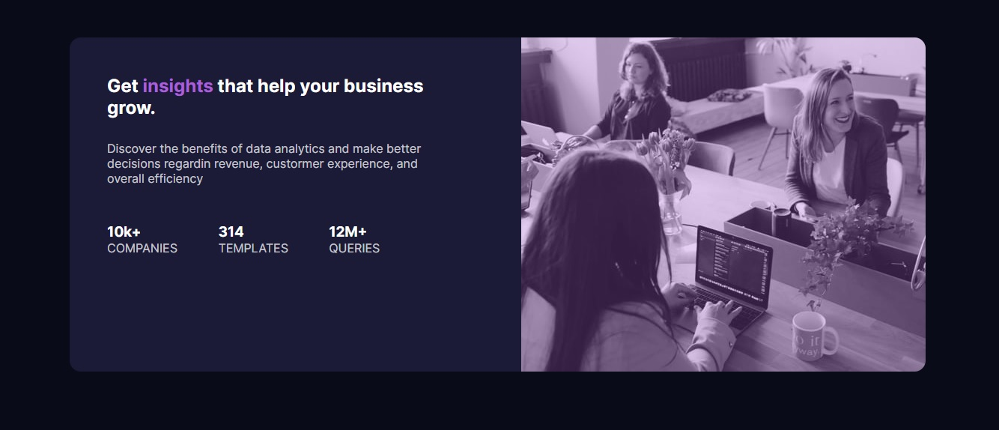

# Frontend Mentor - Stats preview card component solution

This is a solution to the [Stats preview card component challenge on Frontend Mentor](https://www.frontendmentor.io/challenges/stats-preview-card-component-8JqbgoU62). Frontend Mentor challenges help you improve your coding skills by building realistic projects. 

## Table of contents

- [Overview](#overview)
  - [The challenge](#the-challenge)
  - [Screenshot](#screenshot)
  - [Links](#links)
- [My process](#my-process)
  - [Built with](#built-with)
  - [What I learned](#what-i-learned)
- [Author](#author)
- [SpecialThanks](##Special-Thanks)

## Overview
Neste desafio temos que fazer uso de html basico juntamente a css, alem de montar um responsivo para a pagina.

### The challenge

Users should be able to:

- View the optimal layout depending on their device's screen size

### Screenshot




### Links

- Solution URL: [https://github.com/Vitor5782/Projeto-1-FrontEndMentor](https://github.com/Vitor5782/Projeto-1-FrontEndMentor)
- Live Site URL: [https://vitor5782.github.io/Projeto-1-FrontEndMentor/](https://vitor5782.github.io/Projeto-1-FrontEndMentor/)

## My process

### Built with

- Semantic HTML5 markup
- CSS custom properties
- Flexbox
- Mobile-first workflow


### What I learned
Aprendi a fazer um bom uso de tags semanticas, lembrei de fazer o melhor uso possivel de tecnologias que conhecia.
Ao construir meu css tive uma experiencia inovadora com o uso do 'FLEX' que me permitiu mudar a ordem do layout da minha pagina para ficar mais agradavel ao leitor.

```html
    <ul>
      <li>
        <h3>10k+</h3>
        <span>COMPANIES</span>
      </li>
    </ul>
```
```css
  section{
        text-align: center;
        flex-direction: column-reverse;
    }
```
## Author

- Website - [Vitor Hugo](https://www.your-site.com)
- Frontend Mentor - [@Vitor5782](https://www.frontendmentor.io/profile/Vitor5782)
- Facebook - [@vitorhugoteixeira](https://www.facebook.com/vitor.hugo.3591267)

## Special Thanks
-Gostaria de agradeçer especialmente ao Pablo, da equipe DEV EM DOBRO, pela ajuda na hora montar meu responsivo.
-Ao curso DEV QUEST, que me deu toda a base para conseguir desenvolver sozinho está minha primeira de muitas paginas.
